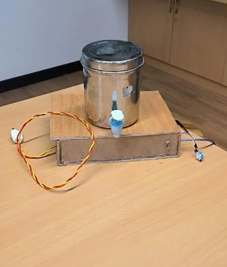

# HydraSafe – Automatic Drinking Water Temperature Controller 🌡️💧

A fully automatic, energy-efficient system that keeps your drinking water at the perfect temperature (15–45 °C) all year round — no buttons, no displays, no manual switching.

  

### Detailed Working Principle (Step-by-Step)

1. **System Startup**  
   As soon as the 12 V 10 A adapter is connected, the Arduino Nano powers up and initializes all sensors and the BTS7960 driver.

2. **Real-Time Temperature Monitoring**  
   Every 2–5 seconds the Arduino reads:  
   - **Ambient (room) temperature** → using DHT11  
   - **Water temperature inside the tank** → using waterproof DS18B20 sensor(s)

3. **Intelligent Decision Making**  
   The brain (Arduino) constantly decides the mode:  
   - **Winter Mode** (ambient < 20 °C) → Turn on **Heating**  
   - **Summer Mode** (ambient > 30 °C) → Turn on **Cooling**  
   - **Comfort Zone** (20 °C ≤ ambient ≤ 30 °C) → Keep Peltier **OFF** (saves maximum power)

4. **Peltier Heating & Cooling Action**  
   - BTS7960 H-bridge supplies high current (~6–8 A) to the two TEC1-12706 Peltier modules  
   - **Heating**: Current flows in forward direction → hot side pressed against water tank → water warms up quickly  
   - **Cooling**: Current direction reversed → cold side against tank → water cools down while large aluminium heat sinks + 12 V fans remove heat from the hot side  
   - The system automatically stops the Peltier as soon as water temperature enters 15–45 °C range (hysteresis logic prevents frequent on/off)

5. **Continuous Loop**  
   The entire process repeats forever → adapts instantly if the weather changes during the day.

### Key Advantages
- ~40 % lower electricity bill compared to always-running kettle or water chiller  
- Zero noise (except quiet fans)  
- No moving parts except fans → extremely reliable  
- Low cost (entire build under ₹1500-2000)  
- Completely set-it-and-forget-it operation

### Components List
- Arduino Nano (brain)  
- TEC1-12706 Peltier modules (heating + cooling element)  
- Large aluminium heat sinks + 12 V cooling fans  
- BTS7960 high-current dual H-bridge driver  
- DS18B20 waterproof temperature sensors (water temperature)  
- DHT11 sensor (ambient temperature)  
- IR proximity sensor (reserved for future glass-detection upgrade)  
- 12 V 10 A SMPS AC-to-DC power adapter  

### Files in this Repository
- `HydraSafe.ino` → Complete, well-commented Arduino source code (ready to upload)

Personal learning & portfolio project  
MIT Licensed → feel free to use, modify, and build your own!

⭐ Star the repo if you like the idea or plan to build it!
